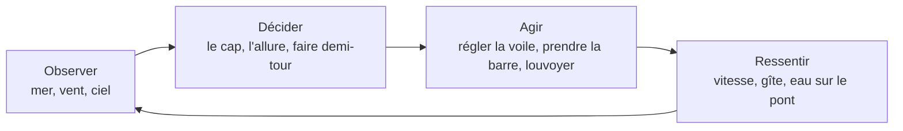
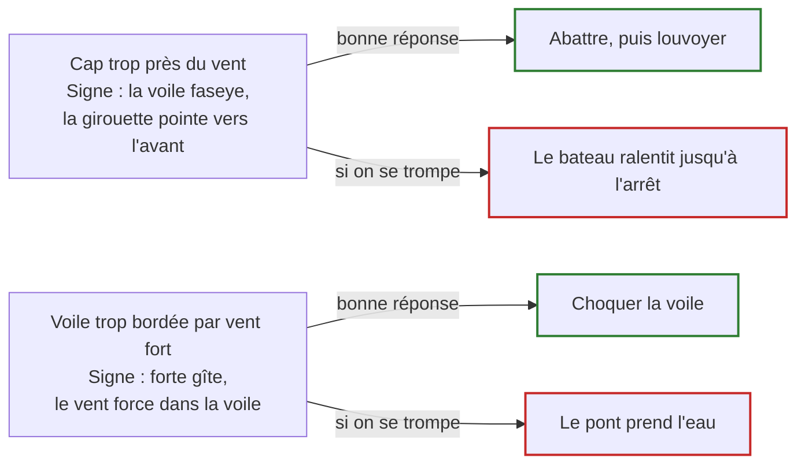
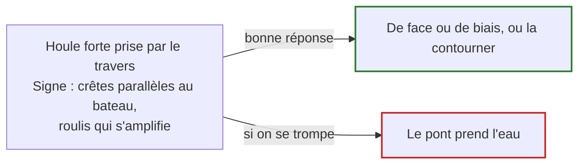
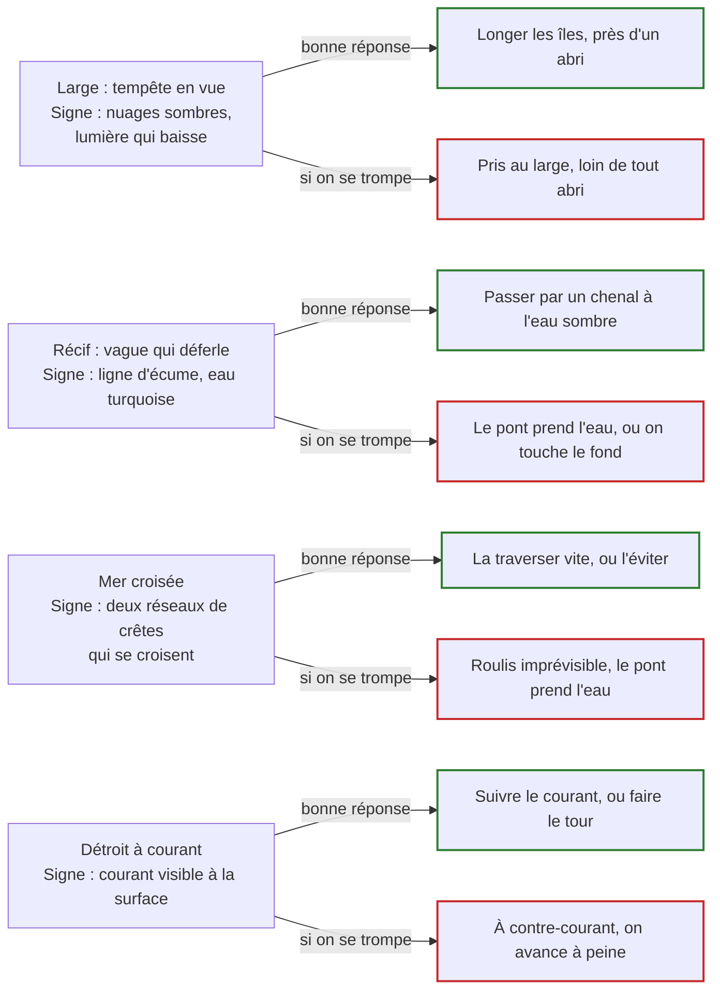
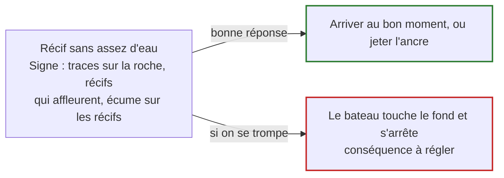
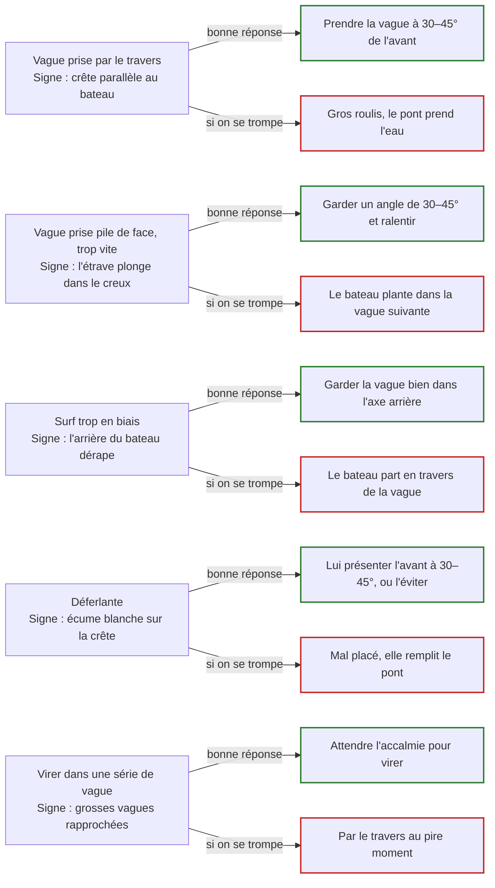
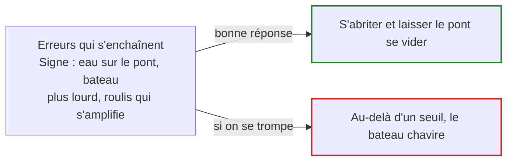

# Schémas du GDD

Transcription à la main des 8 schémas de `gdd.md` que l'export markdown perd : il n'en reste
là-bas qu'un `[embedded content: …]`. Les mêmes contenus, en mermaid, lisibles dans le repo.

**Ce fichier n'est pas régénéré par `/gdd-sync`.** Si un schéma change dans le doc, il faut le
retranscrire ici. Le `pub` ci-dessous est la version du widget au moment de la transcription :
le comparer pour savoir ce qui a bougé.

| Schéma | Widget | `pub` |
| --- | --- | --- |
| Boucle de pilotage | `b87990b4-f84d` | 7 |
| Boucle globale | `a16248f1-93a7` | 7 |
| Vent et voile | `e7863f54-271d` | 1 |
| Houle | `f999d7fb-092c` | 1 |
| Zones de mer | `166690e0-36e8` | 2 |
| Marée | `c7c9be95-ea9c` | 1 |
| Tempête | `274618b8-14b1` | 2 |
| Bateau | `86d0ccf6-1583` | 1 |

## Boucle de pilotage

Navigation, en continu, à la seconde.

## Boucle globale

Chaque sortie enrichit la carte, jusqu'à la route finale.

```mermaid
flowchart TD
    PORT["Partir du port<br/>relire sa carte annotée"]
    PLAN["Planifier une route<br/>destination, fenêtre de marée"]
    NAV["Naviguer<br/>boucle de pilotage"]
    EXP["Explorer un lieu<br/>à pied, en première personne"]
    IND["Trouver un indice<br/>pourquoi ou comment"]
    REL["Relier les indices<br/>annoter la carte"]
    FIN["Tenter le parcours final<br/>bonne route, bon moment"]

    PORT --> PLAN --> NAV
    NAV -->|accoster| EXP
    EXP --> IND --> REL
    REL -->|rentrer ou repartir| PORT
    REL -->|quand la route est comprise| FIN
    NAV -.->|naufrage : mort, retour au port| PORT
```

## Dangers

Les six schémas suivants suivent tous la même forme : à gauche ce que le joueur voit, à droite
les deux issues. C'est la règle « féroce mais juste » — le danger est annoncé par son signe
avant de frapper, et se tromper a une conséquence lisible, jamais fatale d'un coup.

### Vent et voile

### Houle

Une houle forte se prend de face ou de biais, jamais par le travers.

### Zones de mer

Chaque zone a ses dangers, et un signe pour les lire.

### Marée

Un récif se passe au bon moment de la marée.

### Tempête

### Bateau

Une erreur ne fait jamais chavirer d'un coup.

